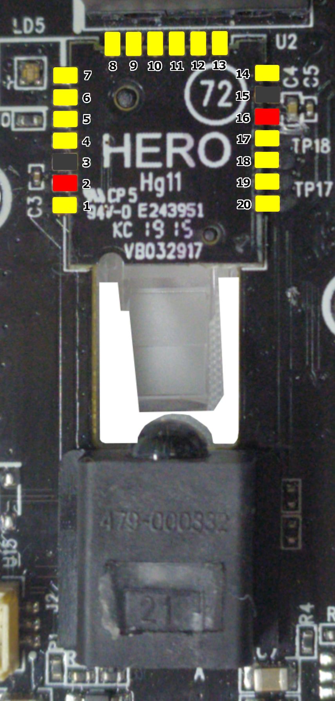
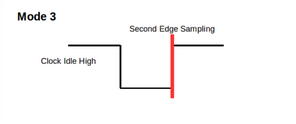

# hero-re

Reverse engineering of the HERO sensor used by Logitech mice

## Pin Configuration

Pin no. | Funcion | Type | Description
:---: | :---: | :---: | :---:
1 | GND | ? |
2 | VDD | Power | Sensor power input
3 | GND | Power |
4 | GND | ? |
5 | IR LED K | LED drive | IR LED Cathode
6 | GND | ? |
7 | NC | NC |
8 | GND | ? |
9 | NC | NC |
10 | GND | ? |
11 | NC | NC |
12 | GND | ? |
13 | NC | NC |
14 | NC | NC |
15 | GND | Power |
16 | DEC | Power | External decoupling for internal 1.7V
17 | SCLK | SPI |
18 | MISO | SPI | also used as motion/wake up pin
19 | MOSI | SPI |
20 | CS | SPI |

## Interface

The Hero sensor uses Serial Peripheral Interface (SPI) as a comunications layer

Chip Select is active low

It uses CPOL = 1, CPHA =  1, aka MODE = 3

Parameter | Value | Unit
:---: | :---: | :---:
Clock Frequency | 4.0 | MHz

## Registers

address | Funcion | Values | Info
:---: | :---: | :---: | :---:
0x00 | ? |  | Status or flag register?
0x05 | delta y high |  | signed 16 bit, 2's complement, top 8
0x06 | delta y low |  |  signed 16 bit, 2's complement, bot 8
0x07 | delta x high |  |  signed 16 bit, 2's complement, top 8
0x08 | delta x low |  | signed 16 bit, 2's complement, bot 8
0x16 | ? | | seems to be related to surface
 |  |  |
0x0C | x or y DPI | 0x03 - 0xEF (allowable range might be larger, to be tested) | DPI = (value + 1) * 50
0x0D | x or y DPI | 0x03 - 0xEF (allowable range might be larger, to be tested) | DPI = (value + 1) * 50
